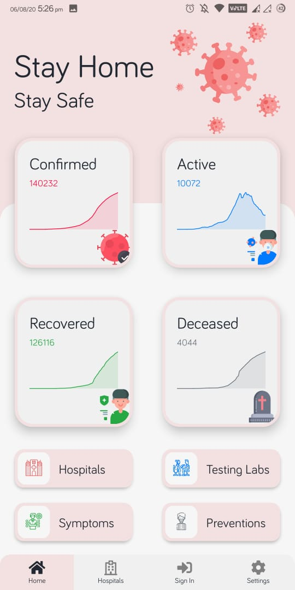
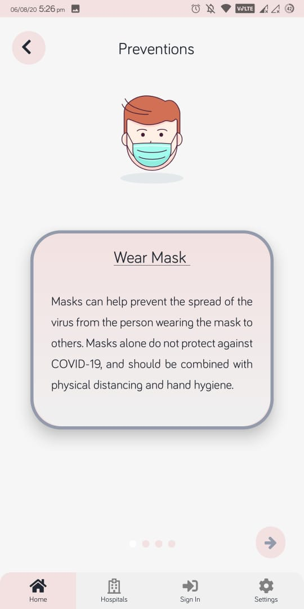
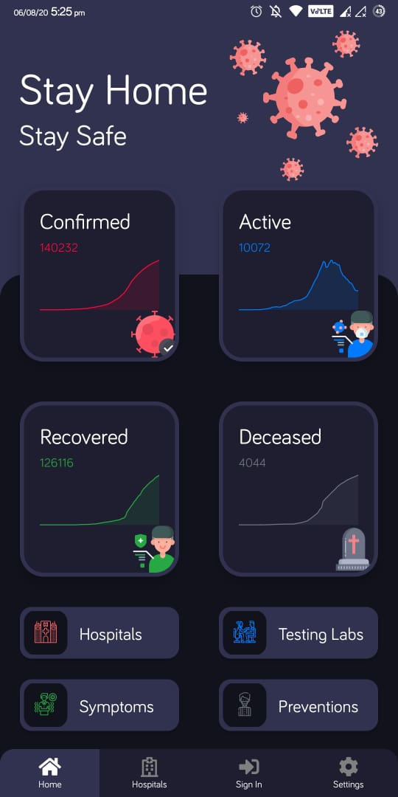
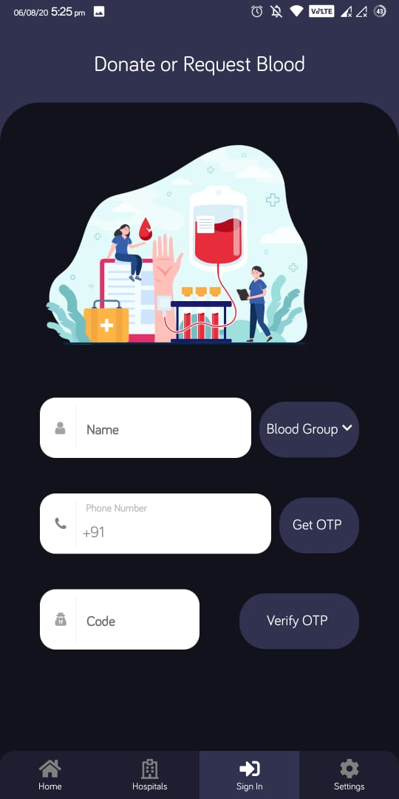

# HealthCare 1.0.0 

*HealthCare lets you find blood donation requests and comes with a Delhi based COVID tracker
that gives you all related information on hospitals, testing labs, symptoms and prevention tips
from the disease.*

<p align="center">

</p>

_____

## Release
<a href="https://github.com/gauravdh9/healthapp/releases/download/Healthcare/healthcare.apk"></a>


## Screenshots 📷

<p align="center">








</p>

## TechStack 🔧

- [ReactJs](https://reactjs.org/)
- [React Native](https://reactnative.dev/)
- [Expo](https://expo.io/)
- [React Navigation](https://reactnavigation.org/)
- [D3](https://d3js.org/)
- [Styled-Components](https://styled-components.com/)
- [Font Awesome](https://fontawesome.com/v4.7.0/icons/)
- [LottieFiles](https://lottiefiles.com/popular)
- [Flaticons](https://www.flaticon.com/)
- [Formik](https://formik.org/)
- [Yup](https://github.com/jquense/yup)
- [MongoDB](https://www.mongodb.com/)
- [Mongoose](https://mongoosejs.com/)
- [ExpressJS](https://expressjs.com/)

## Usage :guardsman:

```
Make sure Node Environment is setup.
Expo CLI is installed.
```
#### Clone this repository and run these commands
```
npm i
expo start
```
#### To create standalone apk

```
expo build:android -t apk
```

## Contributing

Pull requests are welcome. For major changes, please open an issue first to discuss what you would like to change.

Please make sure to update tests as appropriate.

## Authors

- **Gaurav** - _Development_ - [Gaurav](https://github.com/gauravdh9)
- **Soham Singh Yadav** - _Development_ - [SohamSingh](https://github.com/sohamsingh29)
- **Ayush kumar Rout** - _Development_ - [AyushRout](https://github.com/routayush1)
- **Prakhar Sharma** - _Development_ - [prkhrshrmaaaa](https://github.com/prkhrshrmaaaa)

## License
[MIT](https://choosealicense.com/licenses/mit/)

