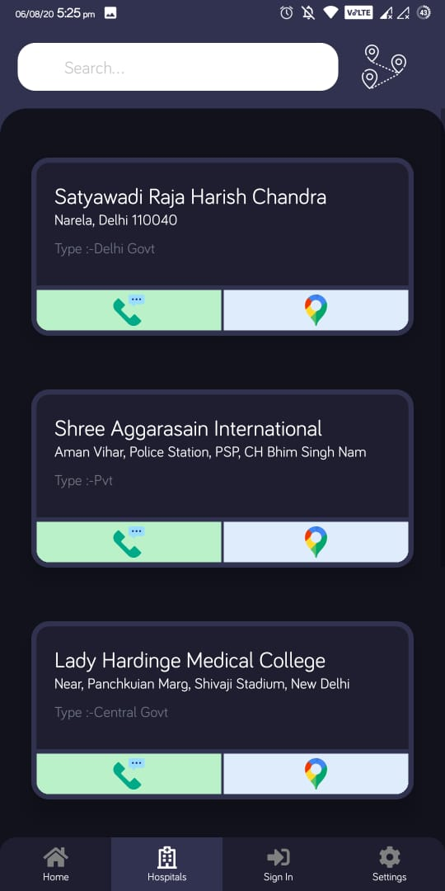

# HealthCare 1.0.0 

*HealthCare lets you find blood donation requests and comes with a Delhi based COVID tracker
that gives you all related information on hospitals, testing labs, symptoms and prevention tips
from the disease.*

_____

## Release

_____

## Screenshots 📷

